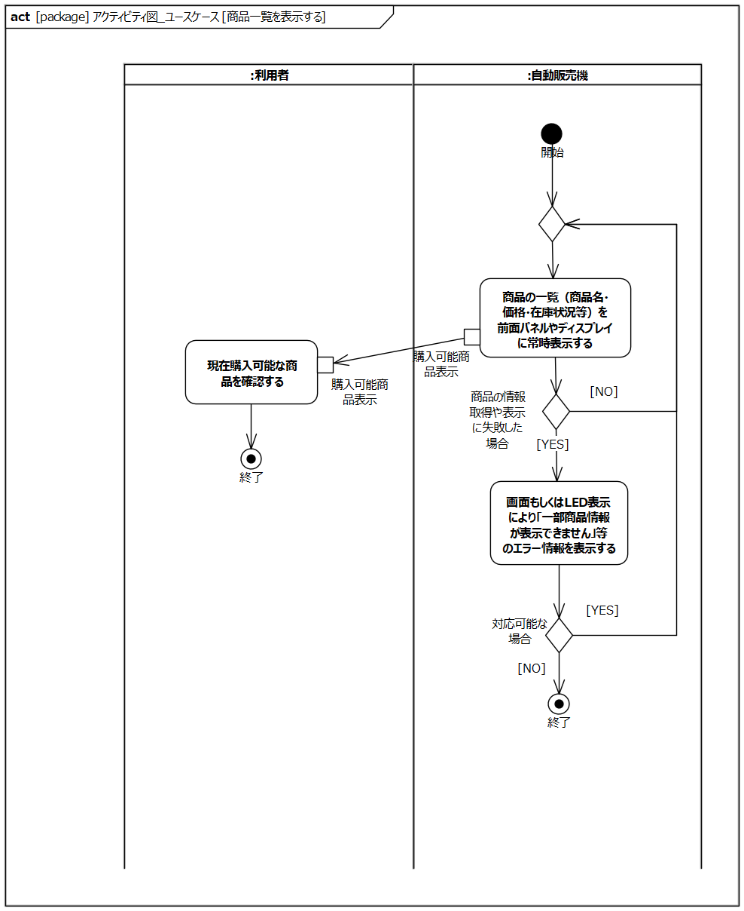

# 自動販売機モデル

## 開発プロセスについて
 - PlantUMLでのダイアグラムをEnterorise Archtect(EA)のSysMLに置き換えます。
 - EAからダイアグラムのXMIを出力し、AI検証のためpythonスクリプトを使ってメタ情報を抽出します。
  
---
## プロセスフロー

---
## システム目標

---
## 安全制約導出

---
## 要求図

  - 自動販売機に対して関係者（利用者、管理者、メンテナンス担当者など）が持つ要求や期待事項を整理し、システムが満たすべき要件を視覚的にまとめた図です。これにより、システムの目的や全体像、関係者ごとのニーズを俯瞰的に把握できます。

## XMIファイル -> Pythonスクリプト -> メタ情報

@import "./要求図/要求図_要素.md"

---
## ユースケース図

  - 自動販売機の利用者や管理者などのアクターと、システムが提供する主要な機能（ユースケース）との関係を視覚的に示します。

## XMIファイル -> Pythonスクリプト -> メタ情報

@import "./ユースケース図/ユースケース_要素.md"

---
## コンテキスト図

  - 自動販売機システムと外部システムやアクターとの情報のやり取りや関係性を俯瞰的に表現します。

---
## ユースケース記述

  - 各ユースケース（機能）の具体的な流れや条件、例外などを文章で詳細に記述します。

@import "./ユースケース記述/お金を投入する.md"

---
@import "./ユースケース記述/商品一覧を表示する.md"

## XMIファイル -> Pythonスクリプト -> メタ情報

@import "./ユースケース記述/商品一覧を表示する_アクティビティ図.md"

---
@import "./ユースケース記述/釣銭・返金を受け取る.md"

---
@import "./ユースケース記述/商品を選択し購入する.md"

---
@import "./ユースケース記述/売上金を回収する.md"

---
@import "./ユースケース記述/商品を補充する.md"

---
@import "./ユースケース記述/釣銭を補充する.md"

---
@import "./ユースケース記述/販売商品を変更する.md"

---
@import "./ユースケース記述/機械の状態を確認する.md"

---
@import "./ユースケース記述/故障対応を行う.md"

---
## ステートマシン図

---
## システム構成図

---
## FMEA分析

---
## FTA分析

---
## アクティビティ図(機能)

---
## STAMPの考え方に基づく対処

---
## シーケンス図_機能検証（シミュレーションによる検証）

---
### 自動販売機モデル 用語集

---
### AI検証のためのプロンプト

---
#### 図妥当性チェック用プロンプト

#### 1. 図妥当性チェック

##### プロンプト:

@import "./プロンプト/図妥当性チェック ユースケース図.txt"

##### AI検証の結果例

@import "./検証結果/図妥当性チェック ユースケース図_検証結果.txt"

---
#### 図間整合性チェック用プロンプト

---
#### 1. 図間整合性チェック: 要求図とユースケース図

##### プロンプト:

@import "./プロンプト/図間整合性チェック 要求図とユースケース図.txt"

##### AI検証の結果例

@import "./検証結果/図間整合性チェック 要求図とユースケース図_検証結果.txt"

